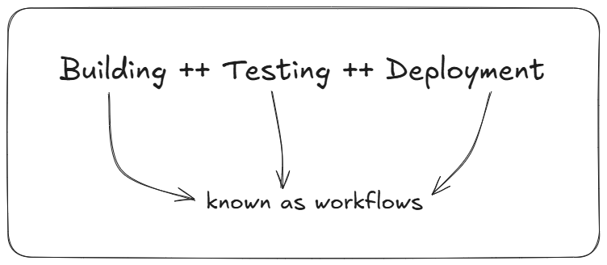

# CI/CD Pipeline using GitHub Actions and AWS S3

In this project, you built a **Continuous Integration and Continuous Deployment (CI/CD)** pipeline to automate the deployment of a application to **Amazon S3**, using **GitHub Actions**.

Whenever changes are pushed to the `main` branch, the pipeline:
- Installs dependencies
- Builds the production-ready app
- Deploys it automatically to an S3 bucket

This ensures zero manual steps for deployment and enables faster shipping of features.

## 📌 Project Overview

The goal of this project is to **automate the entire deployment process**. By integrating GitHub Actions with AWS S3, any commit to the main branch results in a fully updated production site without any developer manually uploading files or running build commands.

## 🔍 Real-Time Usage & Importance

### 🎯 Problem It Solves
> “How can we deploy changes faster, safer, and without human error?”

In real-world applications:
- Developement teams push frequent UI updates and bug fixes
- Manual uploads via FTP or S3 console are time-consuming and error-prone
- Product teams need **fast iterations** and **stable environments**

### ✅ Where It’s Used
- **Startup MVPs** and production apps
- **Personal portfolios** or product landing pages
- **Technical documentation sites** (Docusaurus, MkDocs, Gatsby, etc.)
- **Hackathons** and live product demos

## 🧠 Why This Project Is Important

| Feature                        | Benefit                                                  |
|-------------------------------|-----------------------------------------------------------|
| 🔁 Full Automation             | Eliminates manual deployment steps                       |
| 💡 Modern DevOps Workflow      | Reflects real industry CI/CD practices                   |
| 🌍 Scalable Hosting            | AWS S3 can serve static sites globally                   |
| 🛡️ Secure & Configurable       | Uses IAM roles/secrets instead of hardcoded credentials  |
| ⚡ Rapid Development Cycles    | Instant production updates after each push              |

## ✅ Learning Outcomes

By building this pipeline, I learned to:
- Set up **GitHub Actions workflows**
- Use **AWS S3 for static site hosting**
- Authenticate and deploy using the **AWS CLI**
- Manage **IAM roles** and environment secrets securely
- Structure a **CI/CD workflow** from scratch

## ✅ Final Thoughts

This project showcases the power of **CI/CD** and how it transforms developer workflows. It’s a must-have for developers who want to:
- Learn real-world DevOps practices
- Build reliable deployment systems
- Save time and reduce errors during releases

---

✍️ **Author**: *Anas M*  
📬 *Feel free to connect on [LinkedIn](https://www.linkedin.com/in/anazzm/) or explore more on [GitHub](https://github.com/anazzm)*  

---